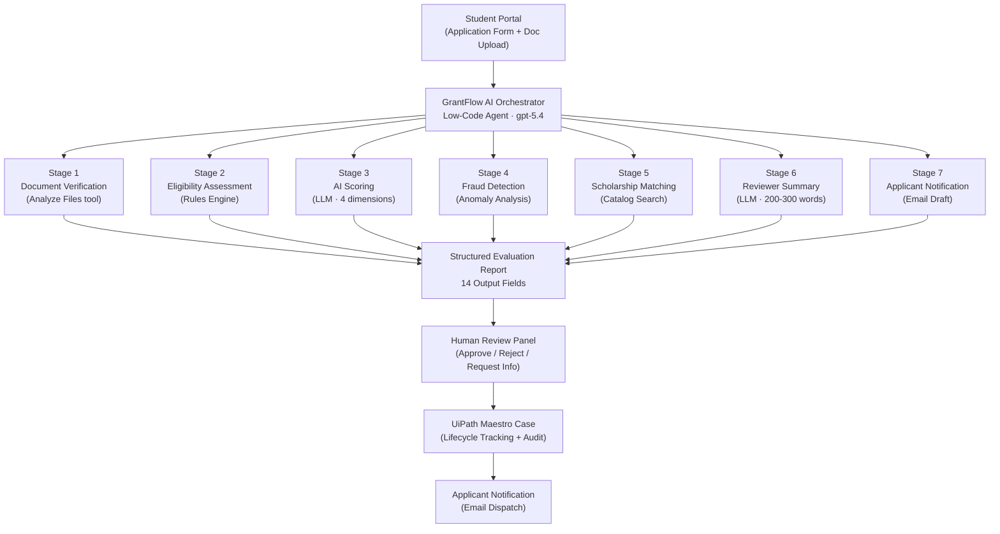
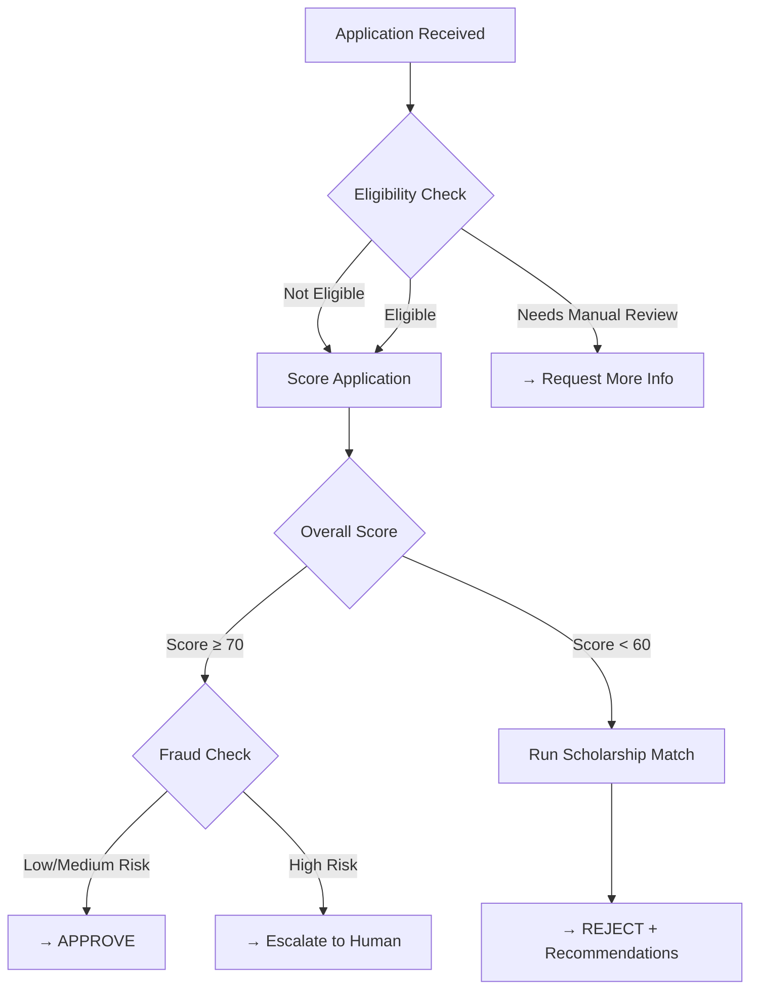
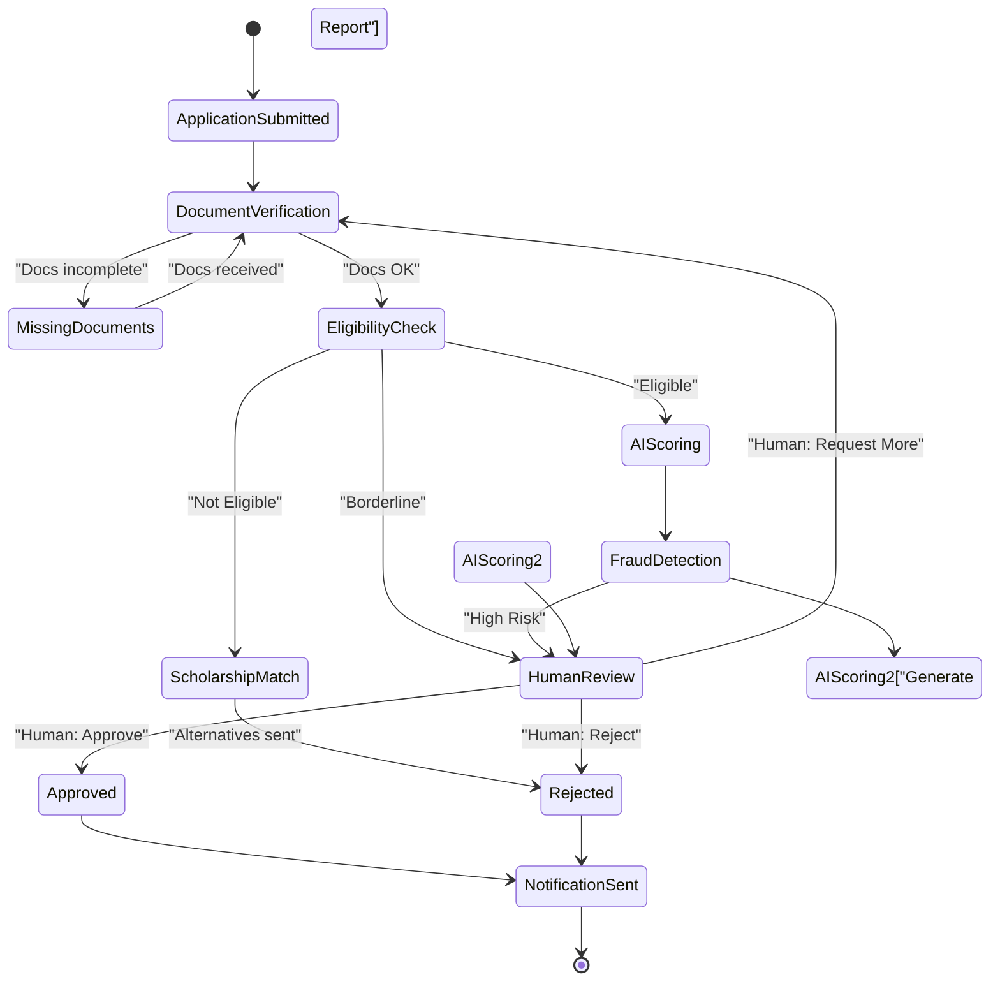

# GrantFlow AI — Architecture Overview

## System Architecture

---

## Component Breakdown

### 1. Agent Layer — GrantFlow AI Orchestrator

| Property | Value |
|----------|-------|
| Type | UiPath Low-Code Autonomous Agent |
| Model | gpt-5.4 |
| Engine | basic-v2 |
| Max Iterations | 25 |
| Tools | Analyze Files, DeepRAG |

The orchestrator receives the full application payload and executes all 7 stages sequentially in a single agent run. It manages tool calls, interprets results, detects fraud patterns, and produces 14 structured output fields.

### 2. Built-In Tools

| Tool | ID | Purpose |
|------|-----|---------|
| Analyze Files | analyze-attachments | OCR + data extraction from PDFs |
| DeepRAG | deep-rag | Deep synthesis of long documents with citations |

### 3. Input Schema (14 fields)

**Text Inputs (10):** applicantName, email, phoneNumber, country, university, degreeProgram, gpa, personalStatement, scholarshipName, scholarshipCriteria

**File Inputs (4, optional):** academicTranscript, nationalId, cv, recommendationLetter (all `job-attachment` type)

### 4. Output Schema (14 fields)

**Structured Decisions:**
- `applicationId` — GF-UNI-YYYYMMDD-XXXX format
- `eligibilityStatus` — Eligible | Not Eligible | Needs Manual Review
- `fraudRiskLevel` — Low | Medium | High
- `recommendedDecision` — Approve | Reject | Request More Info

**Scores (as strings, 0-100):**
- `academicScore`, `leadershipScore`, `communityImpactScore`, `essayQualityScore`, `overallScore`

**Text Outputs:**
- `eligibilityReason`, `fraudRiskReason`, `matchedScholarships` (JSON array), `reviewerSummary`, `notificationMessage`

---

## Decision Flow

---

## Fraud Detection Matrix

| Flag | Severity | Alone → High? |
|------|----------|---------------|
| Name mismatch (form vs document) | Critical | ✅ Yes |
| Impossible GPA value | Critical | ✅ Yes |
| Institution/degree inconsistency | Critical | ✅ Yes |
| Generic/AI-pattern essay | Minor | ❌ Need 3+ |
| OCR failure / blank document | Minor | ❌ Need 3+ |

**Risk Formula:** Low (0) → Medium (1-2 minor) → High (any critical OR 3+ minor)

---

## Scholarship Matching Algorithm

Triggered when: `eligibilityStatus == "Not Eligible"` OR `overallScore < 60`

Matching criteria evaluated in order:
1. GPA compatibility (normalized to 4.0 scale)
2. Degree program alignment
3. Country/citizenship eligibility
4. Special requirements (research, community service, first-gen, etc.)

Output: Ranked list with `match_percentage` (0-100) and `match_reason` per scholarship.

---

## Scoring Weights

| Dimension | Weight | Max Score | Bonus |
|-----------|--------|-----------|-------|
| Academic (GPA) | 30% | 100 | +15 for honours/publications |
| Leadership | 25% | 100 | — |
| Community Impact | 25% | 100 | — |
| Essay Quality | 20% | 100 | — |
| **Overall** | **100%** | **100** | — |

**Formula:** `round(academic×0.30 + leadership×0.25 + community×0.25 + essay×0.20)`

---

## Case Lifecycle (Maestro Integration)

---

## Technology Stack

| Layer | Technology |
|-------|-----------|
| Agent Orchestration | UiPath Agent Builder (Studio Web) |
| Case Management | UiPath Maestro |
| LLM | OpenAI GPT-5.4 |
| Document Processing | UiPath Analyze Files (built-in) |
| Deep Analysis | UiPath DeepRAG (built-in) |
| Platform | UiPath Automation Cloud |
| Runtime | Python Agent Runtime |

---

## Key Design Principles

1. **Humans in control** — AI recommends, humans decide. Every output is a recommendation with confidence level.
2. **Explainability** — Every score includes rationale. Every decision includes a reason. No black boxes.
3. **Fail-safe** — Tool call failures are caught and noted; evaluation continues with available data.
4. **Fairness** — Merit-based evaluation only. Fraud flags require concrete evidence.
5. **No student left behind** — Rejected applicants always receive scholarship alternatives if any match exists.
